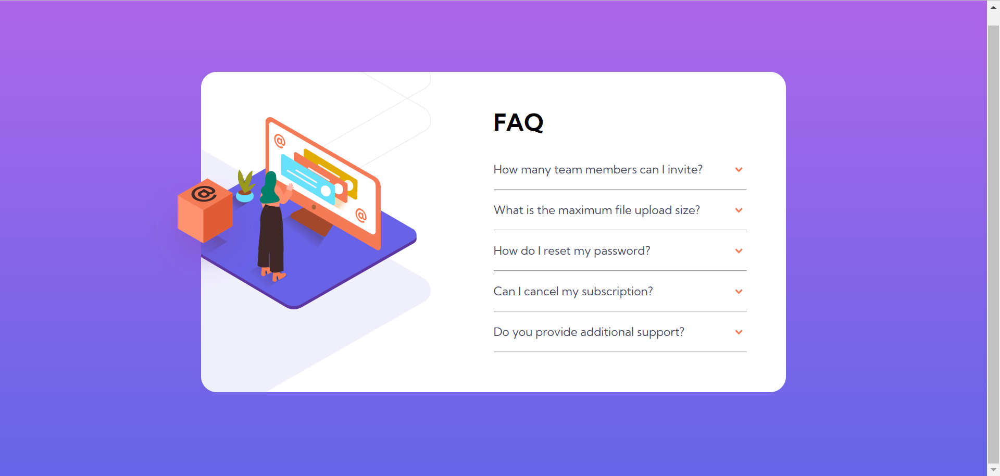
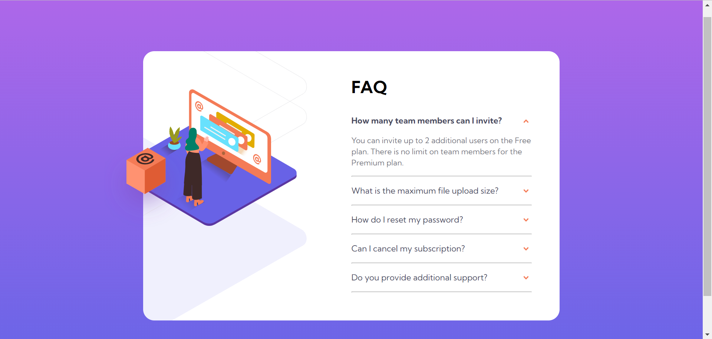
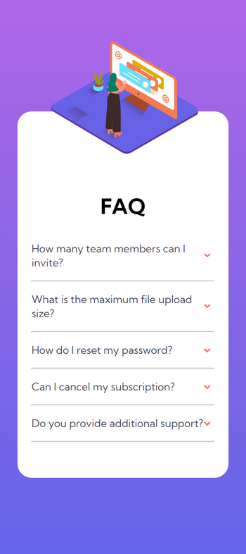

# Frontend Mentor - FAQ accordion card solution

This is a solution to the [FAQ accordion card challenge on Frontend Mentor](https://www.frontendmentor.io/challenges/faq-accordion-card-XlyjD0Oam). 

## Table of contents

- [Overview](#overview)
  - [The challenge](#the-challenge)
  - [Screenshot](#screenshot)
  - [Links](#links)
- [My process](#my-process)
  - [Built with](#built-with)
  - [What I learned](#what-i-learned)
  - [Continued development](#continued-development)
  - [Useful resources](#useful-resources)
- [Author](#author)
- [Acknowledgments](#acknowledgments)

**Note: Delete this note and update the table of contents based on what sections you keep.**

## Overview

### The challenge

Users should be able to:

- View the optimal layout for the component depending on their device's screen size
- See hover states for all interactive elements on the page
- Hide/Show the answer to a question when the question is clicked

### Screenshot

desktop preview  



mobile preview  



### Links

- Solution URL: [See GitHub](https://github.com/Esther-Guo/faq-accordion-card-fm)
- Live Site URL: [Click me!](https://esther-guo.github.io/faq-accordion-card-fm/)

## My process

### Built with

- Semantic HTML5 markup
- CSS custom properties
- Flexbox
- Javascript
- Responsive layout

### What I learned

The property of gradient background is `background-image`!

`float` does not work inside flex container since  float property does not apply to flex-level boxes.

**WHY** put div around images can keep the images to their original size

My AHA moment: Absolute Positioning Inside Relative Positioning.  
When dealing with the cube and woman pictures, we set the div containing them as `position:relative;` and set the images as `position: absolute;`. Then we are able to set image position relative to the div. Otherwise, if we forget to set the div relative, the images would be relative to the body, which we don't want.

`visibility: hidden` would still take up space. `display:none` can fix this issue.

Learned how to position background image!! See demo below
```css
background-image: url(./images/bg-pattern-desktop.svg);
background-size: 700px;
background-position: 108% 76%;
background-repeat: no-repeat;
```

`@media` is soooo helpful for responsive layout. Remember to put the styles at the end so that it can overtake the original ones.

## Author

- GitHub - [Esther-Guo](https://github.com/Esther-Guo)
- Frontend Mentor - [@Esther-Guo](https://www.frontendmentor.io/profile/Esther-Guo)

## Acknowledgments
